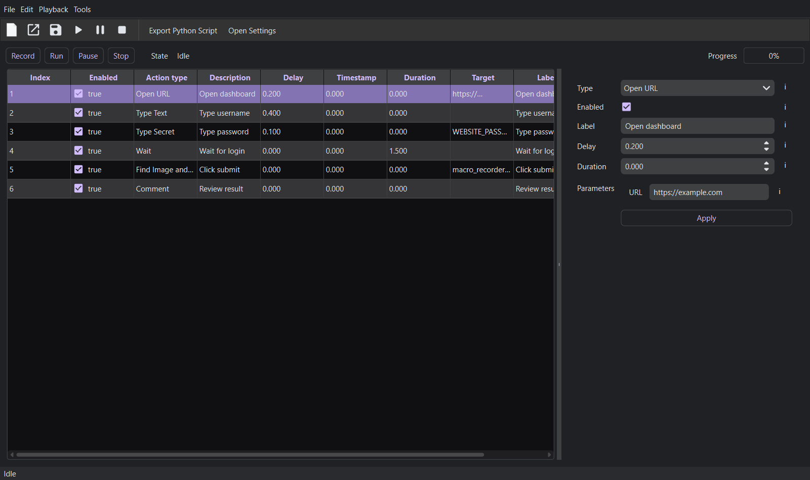

# Macro Recorder +

[](https://github.com/Martonveghcode/macro-recorder-plus/actions/workflows/ci.yml)


Macro Recorder + is a Windows-focused desktop macro recorder and player built with Python, PySide6, Qt Widgets, and pynput. It records global keyboard and mouse activity, normalizes recordings into editable actions, saves a documented JSON macro file, exports standalone Python playback scripts, and can hand those scripts to PyInstaller for optional `.exe` builds.



## Highlights

- Record keyboard input, mouse clicks, mouse movement, and scroll actions from the desktop.
- Edit recorded steps as structured actions before playback.
- Add manual actions for URLs, local files, launched programs, typed text, secrets, image clicks, waits, and comments.
- Export macros as standalone Python scripts with runtime dependency files and a generated `run_*.bat` launcher.
- Build optional Windows executables through PyInstaller from inside the app.
- Store secrets by environment variable name so passwords are not written into macro files.
- Configure playback speed, countdowns, hotkeys, theme, accent color, and widget corner shape.

## Install

```powershell
python -m venv .venv
.\.venv\Scripts\Activate.ps1
pip install -r requirements-dev.txt
```

## Run

```powershell
python -m macro_recorder_plus
```

The application declares per-monitor DPI awareness before creating `QApplication`. Global hooks may require running from a normal interactive desktop session.

Appearance settings are available under **Settings > Appearance Customisation**. The default theme is dark with primary accent `#D0BCFF` and sharp corners.

## Export

Use **Export Python Script** to create a standalone `.py` macro runner. Exports include:

- the generated macro script,
- `macro_recorder_plus_runtime/requirements.txt`,
- `macro_recorder_plus_runtime/install_dependencies.bat`,
- optional `macro_recorder_plus_assets/` image templates,
- a generated `run_*.bat` launcher,
- `README_exported_macros.txt` with run commands.

The generated script also supports direct CLI use:

```powershell
python exported_macro.py
python exported_macro.py --install-deps
python exported_macro.py --speed 1.5
python exported_macro.py --dry-run
python exported_macro.py --start-action 12
```

Use **Export Windows EXE** to export the Python script first, then run PyInstaller through the GUI. PyInstaller is optional and is listed in `requirements-dev.txt`.

## Export Settings

The **Settings > Export** tab controls these defaults:

- **Default export directory**: the starting folder for Python script exports and EXE output.
- **Python interpreter path**: optional Python executable used in generated batch files and PyInstaller builds. Leave blank to use the Python running the app.
- **PyInstaller executable path**: optional `pyinstaller.exe` path. Leave blank to run the selected Python with `-m PyInstaller`.
- **Default .exe options**: optional extra PyInstaller switches such as `--windowed --clean`.

## Secret Actions

**Type Secret** stores only an environment variable name, not the secret itself. At playback time it reads from the running process environment using `os.environ["VARIABLE_NAME"]`.

For the GUI, set a Windows user or system environment variable such as `WEBSITE_PASSWORD`, then restart Macro Recorder + so the shortcut-launched process inherits the new value. For exported scripts, you can also set it in the terminal before running:

```powershell
$env:WEBSITE_PASSWORD = "secret"
python exported_macro.py
```

If the variable is missing, GUI playback errors. Exported scripts prompt only when they are running in an interactive terminal.

## Test

```powershell
pytest
python -m compileall macro_recorder_plus tests
```

For headless Qt test runs:

```powershell
$env:QT_QPA_PLATFORM = "offscreen"
pytest
```

## Repository Structure

```text
macro_recorder_plus/
  application.py
  app.py
  exporters/
  models/
  platform/
  playback/
  recorder/
  storage/
  ui/
  utilities/
docs/
examples/
packaging/
tests/
```

## Documentation

- [JSON macro schema](docs/json-schema.md)
- [Manual Windows test checklist](docs/manual-windows-test-checklist.md)
- [Contributing guide](CONTRIBUTING.md)

## Known Limitations

- The implementation records keyboard press/release events and mouse movement groups, but deeper semantic recognition of every possible shortcut is intentionally conservative.
- Display-layout transformation support includes exact/scaled coordinate modes and clamping helpers; complex per-monitor remapping should be manually checked before running destructive macros.
- PyInstaller packaging must be validated on the final target Windows machine because Qt plugin discovery can vary by Python environment.
- Secret actions read from the process environment or an interactive prompt in exported scripts; secrets are not stored in macro files.

## License

No license file is included yet. Add one before distributing this as an open source project or accepting outside contributions.
