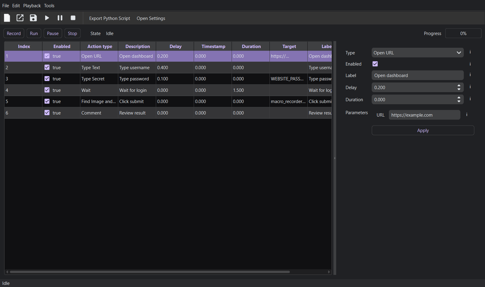

# Macro Recorder +


The macro recorder that actually works. Windows desktop app built with Python and PySide6 for recording, editing, replaying, and exporting keyboard and mouse workflows. Exports to `.py` and `.exe` to make your macros run effortlessly. Fully open source and free.



## Highlights

- Record keyboard input, mouse clicks, mouse movement, and scroll actions from the desktop.
- Automatically capture modifier chords such as Ctrl+C, Ctrl+V, Ctrl+X, Alt+Tab, and Ctrl+Shift+S as keyboard-shortcut actions.
- Edit recorded steps as structured actions before playback, including per-action loop counts up to 99,999 repeats.
- Add manual actions for URLs, local files, launched programs, typed text, secrets, image clicks, custom image-relative mouse movement, waits, and comments.
- Export macros as standalone Python scripts with runtime dependency files and a generated `run_*.bat` launcher.
- Build optional Windows executables through PyInstaller from inside the app.
- Store secrets by environment variable name so passwords are not written into macro files.
- Configure whole-macro loop counts, playback speed, countdowns, hotkeys, theme, accent color, and widget corner shape.
- Keep one-time setup steps in a separate pre-action list, so apps and documents open once before a repeating main macro.
- Capture an open app window's monitor, position, size, and maximized state for exact restoration during playback.

## Install

```powershell
python -m venv .venv
.\.venv\Scripts\Activate.ps1
pip install -r requirements-dev.txt
```

## Run

```powershell
python -m macro_recorder_plus
```

The application declares per-monitor DPI awareness before creating `QApplication`. Global hooks may require running from a normal interactive desktop session.

Appearance settings are available under **Settings > Appearance Customisation**. The default theme is dark with primary accent `#D0BCFF` and sharp corners.

## Pre-actions and saved app positions

Use the **Pre-actions (run once)** tab for setup work such as opening apps, documents, or URLs. These actions run once whenever you start the macro; only the **Main actions (looped)** tab is affected by the whole-macro loop count. The usual Insert Action menu, editing controls, and undo/redo work on the active tab.

For an **Open URL**, **Open File**, or **Launch Program** action, arrange the target browser or app window first, then click **Capture open window position...** in its properties and choose the window. The action immediately stores its monitor identity, position, size, and maximized state. If the monitor layout later changes, playback first tries the saved monitor identity, then its monitor number, and keeps the window inside the available work area.

## Export

Use **Export Python Script** to create a standalone `.py` macro runner. Exports include:

- the generated macro script,
- `macro_recorder_plus_runtime/requirements.txt`,
- `macro_recorder_plus_runtime/install_dependencies.bat`,
- optional `macro_recorder_plus_assets/` image templates,
- a generated `run_*.bat` launcher,
- `README_exported_macros.txt` with run commands.

The generated script also supports direct CLI use:

```powershell
python exported_macro.py
python exported_macro.py --install-deps
python exported_macro.py --speed 1.5
python exported_macro.py --loops 3
python exported_macro.py --dry-run
python exported_macro.py --start-action 12
```

Use **Export Windows EXE** to export the Python script first, then run PyInstaller through the GUI. PyInstaller is optional and is listed in `requirements-dev.txt`.

## Export Settings

The **Settings > Export** tab controls these defaults:

- **Default export directory**: the starting folder for Python script exports and EXE output.
- **Python interpreter path**: optional Python executable used in generated batch files and PyInstaller builds. Leave blank to use the Python running the app.
- **PyInstaller executable path**: optional `pyinstaller.exe` path. Leave blank to run the selected Python with `-m PyInstaller`.
- **Default .exe options**: optional extra PyInstaller switches such as `--windowed --clean`.

## Secret Actions

**Type Secret** stores only an environment variable name, not the secret itself. At playback time it reads from the running process environment using `os.environ["VARIABLE_NAME"]`.

For the GUI, set a Windows user or system environment variable such as `WEBSITE_PASSWORD`, then restart Macro Recorder + so the shortcut-launched process inherits the new value. For exported scripts, you can also set it in the terminal before running:

```powershell
$env:WEBSITE_PASSWORD = "secret"
python exported_macro.py
```

If the variable is missing, GUI playback errors. Exported scripts prompt only when they are running in an interactive terminal.

## Documentation

- [JSON macro schema](docs/json-schema.md)
- [Manual Windows test checklist](docs/manual-windows-test-checklist.md)
- [Contributing guide](CONTRIBUTING.md)

## License

No license file is included yet. Add one before distributing this as an open source project or accepting outside contributions.
